# 1. Introducció
FoodLogístic S.A. ha crescut i ara té més rutes i més treballadors, i per això necessita millorar els seus sistemes informàtics perquè la feina no s’aturi quan hi ha problemes.

Aquesta memòria tècnica explica la solució que proposem perquè el client la pugui entendre, veure clarament com funcionarà i decidir si es pot fer abans de posar-la en marxa.  
La proposta té quatre parts:

1. Que els fitxers i les impressores funcionin sempre.
2. Passar el correu i el treball en equip al núvol.
3. Millorar la seguretat i la formació sobre dades personals.
4. Fer una web nova que compleixi la normativa.

---
<br>
<br>
<br>
<br>
<br>
<br>
<br>
<br>

# 2. Anàlisi de necessitats del client

## 2.1 Situació actual
FoodLogístic S.A. ha crescut en els darrers anys. Té més rutes i més treballadors, i també genera més informació. Per això, la infraestructura informàtica que tenia abans ara es queda curta. La direcció està preocupada per tres coses:

- Que les dades estiguin segures.
- Que els serveis no es parin.
- Que el sistema pugui créixer sense problemes.

## 2.2 Usuaris i ús de la informació
L’empresa té aproximadament **35 usuaris** repartits sobretot entre **Operacions, Administració i Direcció**. Treballen amb documents molt importants, com **albarans** i **documents interns**, i també amb **dades personals**. Per això, és necessari que cada usuari només tingui accés al que li toca, per evitar errors i riscos.

---

## 2.3 Necessitats principals

### Gestió de fitxers
Ara cal millorar l’ordre dels fitxers i el control d’accés. L’empresa necessita un **servidor de fitxers centralitzat** amb:

- Carpetes per departaments.
- Permisos clars.
- Control de l’espai.

També és important que el servei sigui **estable** i tingui **més disponibilitat**, perquè si els fitxers fallen, es frena la feina.

### Servei d’impressió
La impressió és clau, sobretot al magatzem, perquè es fan **etiquetes** i **documents de tramesa**. La instal·lació manual d’impressores fa perdre temps i genera incidències. Cal un sistema centralitzat d’impressió que:

- Instal·li impressores automàticament als equips.
- Pugui repartir la càrrega entre diverses impressores per reduir bloquejos.

### Correu i treball al núvol
El correu actual no dona prou fiabilitat i tampoc facilita el treball en equip. FoodLogístic necessita un correu al núvol més estable, amb:

- Correu professional.
- Calendari compartit.
- Eines de treball en equip.

També és important que el cost sigui **fàcil d’entendre i de controlar**.

### Seguretat i compliment legal
S’ha detectat manca d’hàbits i formació en seguretat i protecció de dades. Això és un risc perquè un descuit pot provocar problemes amb dades personals. Cal complir el **RGPD** i la **LOPD**, amb:

- Mesures tècniques.
- Formació clara per als treballadors.

### Presència web
La web actual no dona una imatge prou professional i no compleix del tot la normativa. Cal una **landing nova**, clara i actual, amb:

- Formulari de contacte.
- Textos legals necessaris.
- Gestió correcta de cookies i privacitat (perquè el formulari recull dades personals).

---

## 2.4 Taula resum de necessitats

| Problema | Necessitat del client | Prioritat |
|---|---|---|
| Fitxers poc ordenats i permisos poc clars | Servidor de fitxers amb carpetes per departament, permisos per grup i control d’espai | **Alta** |
| Impressió amb incidències i instal·lació manual | Servidor d’impressió amb instal·lació automàtica i repartiment de la càrrega entre impressores | **Alta** |
| Correu actual poc fiable i sense eines d’equip | Correu al núvol amb correu professional, calendari compartit i eines de treball en equip | **Alta** |
| Falta d’hàbits de seguretat | Formació i normes simples per evitar errors amb dades personals | **Mitjana-alta** |
| Web antiga i amb mancances legals | Landing nova amb formulari i textos legals, i gestió correcta de cookies i privacitat | **Alta** |


<br>
<br>
<br>
<br>
<br>
<br>
<br>
<br>

# 3. Solució proposta

La nostra proposta resol els **4 punts** que demana FoodLogístic S.A.:

1. **Fitxers i impressores amb continuïtat**
2. **Correu i col·laboració al núvol**
3. **Seguretat i formació (LOPD/RGPD)**
4. **Web nova i legal**

L’objectiu és que l’empresa pugui treballar **sense parades**, amb **permisos ben configurats** i amb una base **segura** i **fàcil de mantenir**.

A nivell pràctic, la solució es basa en **3 idees simples**:
- **Organitzar**
- **Protegir**
- **Evitar caigudes**

Per demostrar-ho, aportem **taules, diagrames i captures pròpies** de la configuració i les proves.

---

## Resum ràpid de la proposta

| Àrea | Què fem | Resultat |
|---|---|---|
| Fitxers | Carpetes compartides + permisos per grups | Accés ordenat i segur |
| Impressió | Servidor d’impressió + repartiment de cues | Impressió més estable |
| Núvol | Correu i col·laboració al núvol | Menys fallades i millor treball en equip |
| Seguretat | Bones pràctiques + formació LOPD | Menys riscos per dades personals |
| Web | Landing moderna i legal | Imatge millor i compliment normatiu |

---

## 3.1 Infra i HA

En aquesta part treballem el que és més crític per a FoodLogístic: **fitxers i impressores**.  
Si això falla, el **magatzem** i l’**oficina** poden quedar aturats.

El client ja té **Directori Actiu (Active Directory)** i nosaltres l’aprofitem per controlar **usuaris, grups i permisos** d’una manera ordenada.

### Fitxers (servidor + permisos)
- Hem organitzat l’Active Directory per **departaments** i hem creat **grups**.
- Hem creat **carpetes compartides** i hem assignat **permisos per grup** (no usuari per usuari), perquè sigui:
  - més fàcil d’administrar,
  - més segur,
  - i més escalable.
- Fem que cada persona només vegi el que li toca (**principi de mínim privilegi**).
- Afegim **límits d’espai** i **filtres** per evitar que el servidor s’ompli amb arxius que no són de feina.

### Impressió (servidor + cues + desplegament automàtic)
- Hem muntat un **servidor d’impressió** amb **dues impressores** del magatzem.
- Hem activat el **repartiment de feines** perquè no vagi tot a una sola cua.
- Fem el **desplegament amb polítiques** perquè els treballadors no hagin d’instal·lar res manualment, tal com demana el projecte.

---

### Resum: què fem i per què

| Servei | Què fem | Per què |
|---|---|---|
| Fitxers | Carpetes compartides i permisos per grups | Ordre i seguretat en documents |
| Fitxers | Límits d’espai i filtres | Evitar disc ple i arxius “no toca” |
| Impressió | Servidor d’impressió i cues repartides | Menys bloquejos i més continuïtat |
| Impressió | Instal·lació automàtica amb polítiques | Més fàcil per als usuaris |

---

## Què vol dir “alta disponibilitat” (HA)

El client demana que els serveis crítics **no s’aturin mai**.  
El que hem muntat **millora molt l’ordre** i **redueix problemes**, però per tenir **alta disponibilitat completa**, la proposta professional és afegir **redundància**: tenir una alternativa preparada si un servidor falla.

### Proposta clara de redundància
- **Fitxers:** dos servidors de fitxers amb **rèplica**, perquè si un cau, l’altre pugui continuar donant servei.
- **Impressió:** mantenir **dues impressores** i, si cal més seguretat, tenir també un **segon servidor d’impressió** preparat.

### Diagrama simple del funcionament
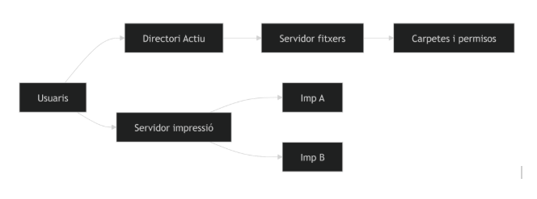
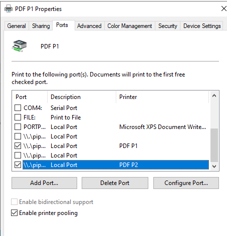
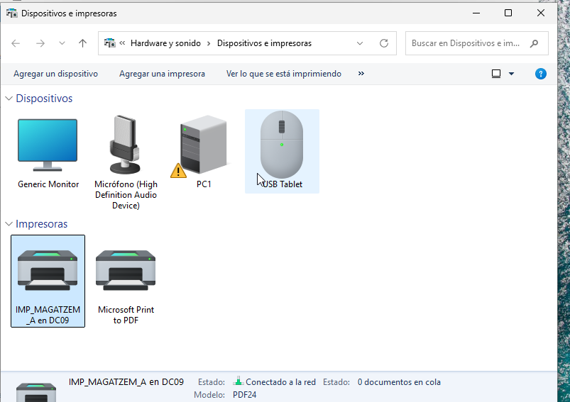
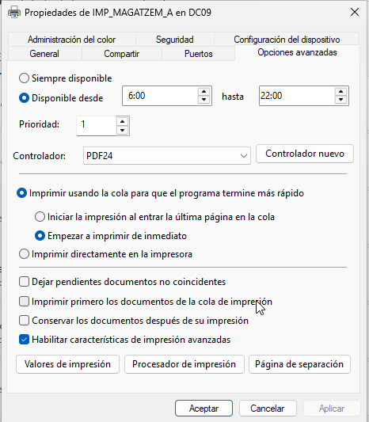


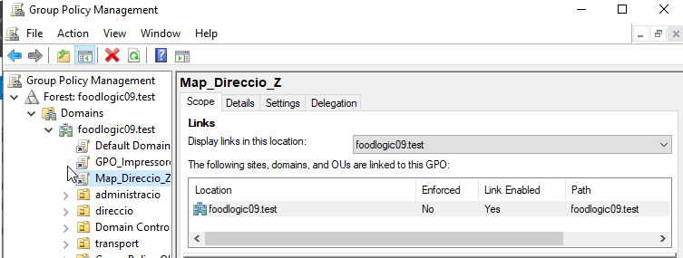


## 3.2 Núvol i mail

FoodLogístic vol passar del correu intern, que falla sovint, a una solució al núvol que sigui estable i que també ajudi a treballar en equip.

Per això hem comparat diverses opcions i proposem **Microsoft 365 Empresa Estàndard**, perquè és una solució completa: correu professional, emmagatzematge i eines de col·laboració com **Teams** i **calendaris compartits**.

Per fer-ho clar, aquesta és la comparació resumida que hem fet amb opcions de PIME, mirant preu i què inclou cada servei:

| Plataforma | Preu aproximat | Emmagatzematge | Punts clau |
|---|---:|---:|---|
| Microsoft 365 Empresa Estàndard | 10,80 € usuari/mes | 1 TB usuari | Eines completes i molt ús a empreses |
| Google Workspace Business Standard | 13,80 € usuari/mes | 2 TB usuari | Bona col·laboració i edició alhora |
| Zoho Workplace | 3,00 € usuari/mes | 30 GB usuari | Opció econòmica, funcions bàsiques |
| Lark Suite | 7,40 € usuari/mes | espai compartit | Plataforma moderna, tot integrat |

La tria final és **Microsoft 365 Empresa Estàndard** perquè dona un paquet molt complet i és fàcil d’aplicar a una empresa com FoodLogístic: correu, núvol, reunions i treball en equip en un mateix lloc.

En cost, el preu oficial del pla és **10,80 € per usuari i mes** amb pagament anual.  
Per **35 usuaris**, això són **4.536 € a l’any**.

La migració del correu es planteja de manera que no es perdi informació: es copien els correus antics al nou sistema amb eines de migració, i es fa el canvi en un moment controlat per evitar aturar la feina.

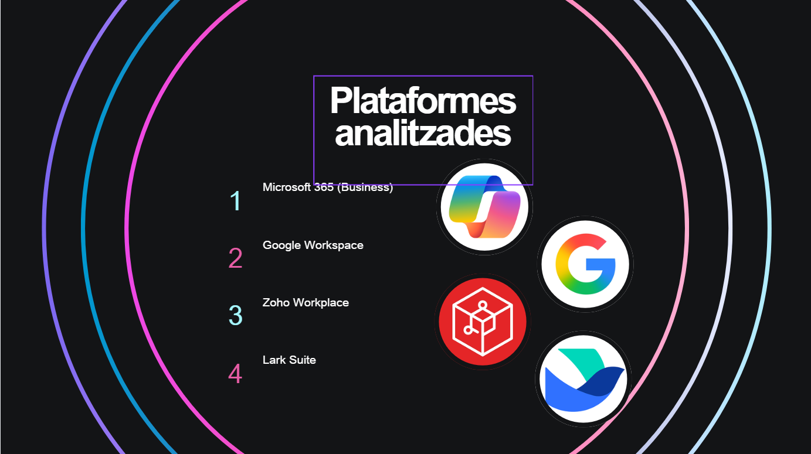
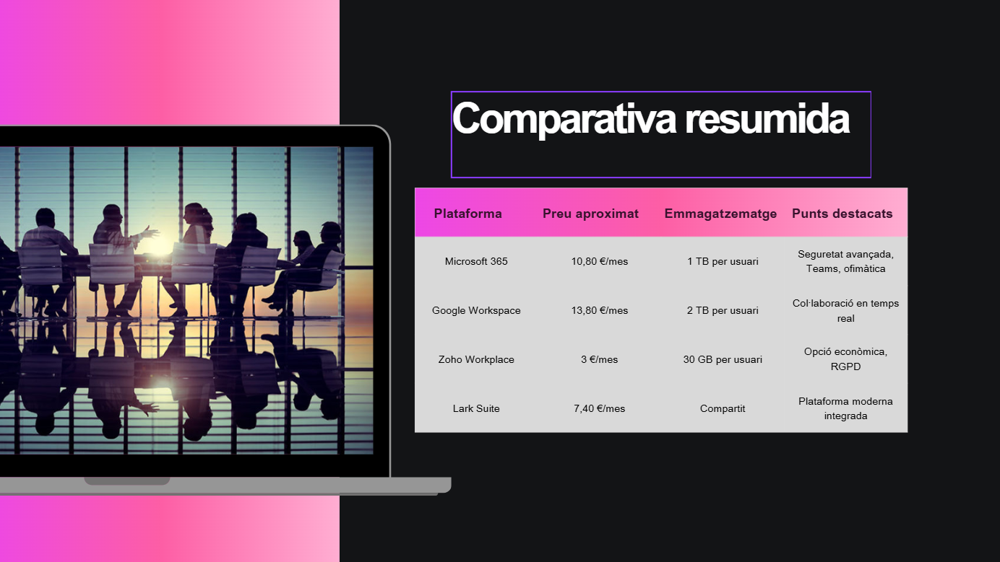
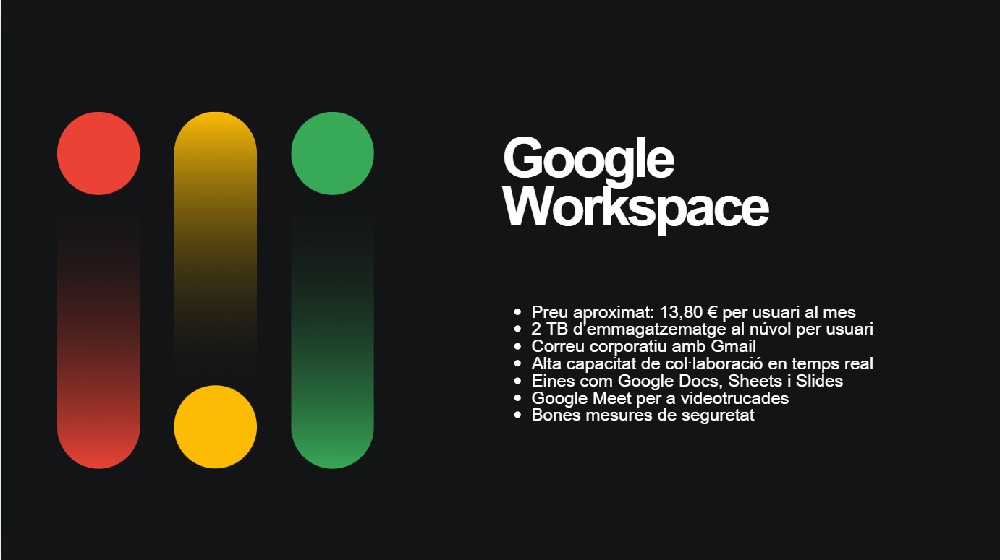

---

## 3.3 Seguretat i LOPD

FoodLogístic té dades de clients i treballadors, i aquestes dades s’han de cuidar bé.  
Per això, la nostra proposta fa dues coses: **posar normes fàcils** i **fer formació** perquè tothom les segueixi.

La part de formació és un **vídeo curt**, pensat per a la nova plantilla, on s’expliquen hàbits simples per evitar errors amb dades personals.  
Això és important perquè moltes vegades el problema no és un “hack”, sinó un **descuit**: deixar papers a la impressora, no bloquejar la pantalla o guardar dades on no toca.

### Normes bàsiques (fàcils d’aplicar cada dia)
- Bloquejar la pantalla quan t’aixeques.
- Fer servir contrasenyes fortes i no compartir-les.
- Recollir els documents de la impressora al moment.
- Guardar els documents només als sistemes de l’empresa, no en núvol personal.
- No connectar USB desconeguts i usar només els autoritzats.
- Triturar o destruir bé els papers amb dades quan ja no calen.

Per veure-ho clar, aquí tens una taula amb “què fem” i “què evitem”:

| Què fem | Què evitem |
|---|---|
| Permisos ben posats i accés per grups | Que algú vegi dades que no li toquen |
| Bons hàbits de contrasenya i pantalla bloquejada | Entrades no autoritzades per descuits |
| Impressió segura | Papers amb dades personals abandonats |
| Ús correcte d’espais de l’empresa | Pèrdua de control de les dades |
| Cura amb USB i dispositius | Virus i robatori de dades |

Amb tot això, el client redueix riscos i compleix millor la protecció de dades, perquè la seguretat passa a ser una rutina normal del dia a dia.

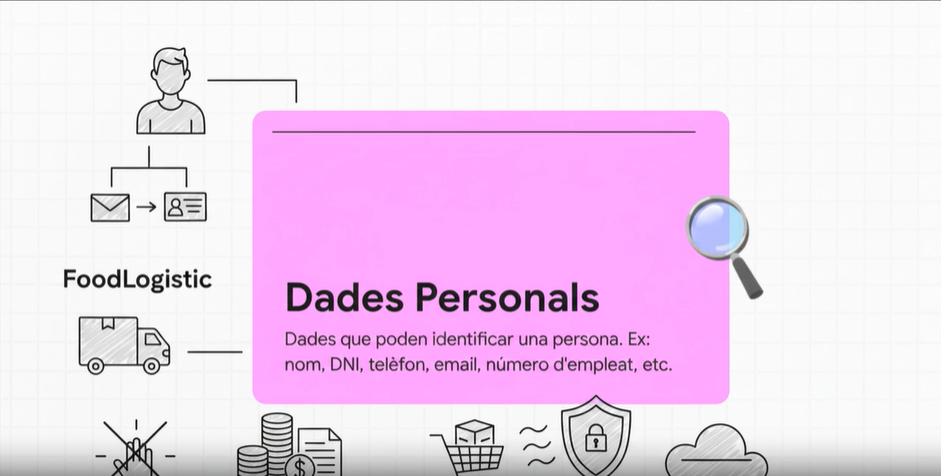
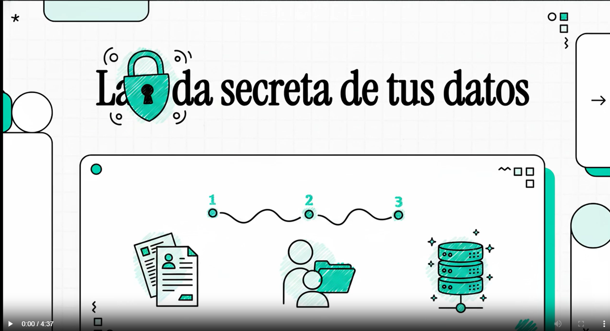

## 3.4 Web i presència

FoodLogístic necessita una web més moderna perquè la seva web antiga dona mala imatge i, a més, no compleix bé la normativa.

La proposta és fer una **landing page senzilla** que expliqui qui són i què fan, i que tingui un **formulari de contacte** perquè els clients els puguin escriure fàcilment.

Com que a la web es poden recollir **dades personals** amb el formulari, també cal complir la part legal:
- **Avís legal**
- **Política de privacitat**
- **Política de cookies**
- **Banner/avís de cookies** per acceptar o rebutjar

Això evita problemes i dona confiança al client, perquè tot queda clar i ben explicat.

Ara os posare una tros de codi de cada arxiu:

#### index.html
```bash
<!DOCTYPE html>
<html lang="ca">
<head>
    <meta charset="UTF-8">
    <meta name="viewport" content="width=device-width, initial-scale=1.0">
    <title>FoodLogics — Tecnologia Alimentària</title>
    <meta name="description" content="FoodLogics: transformem la indústria alimentària amb tecnologia avançada, logística intel·ligent i anàlisi de dades.">

    <!-- ✅ FIX: Preconnect a fonts abans que el navegador les demani -->
    <link rel="preconnect" href="https://fonts.googleapis.com">
    <link rel="preconnect" href="https://fonts.gstatic.com" crossorigin>

    <link href="https://fonts.googleapis.com/css2?family=Playfair+Display:ital,wght@0,400;0,600;0,700;0,800;1,400&family=DM+Sans:ital,wght@0,300;0,400;0,500;0,600;0,700;1,400&display=swap" rel="stylesheet">

    <!-- ✅ FIX: CSS asíncron — no bloqueja el renderitzat inicial -->
    <link rel="preload" href="styles.css" as="style" onload="this.onload=null;this.rel='stylesheet'">
    <noscript><link rel="stylesheet" href="styles.css"></noscript>
```

#### styles.css
```bash
:root {
    --primary: #0C4B33;
    --primary-dark: #082E1F;
    --primary-light: #1A6B4A;
    --accent: #E85D3A;
    --accent-hover: #D44E2C;
    --accent-light: #FF7F5C;
    --gold: #D4A853;
    --cream: #FBF5EB;
    --white: #FFFFFF;
    --dark: #0F1A17;
    --dark-card: #162420;
    --dark-border: #1E332D;
    --text: #1F2937;
    /* ✅ MILLORA: Contrast #4B5563 sobre blanc = 7.1:1 (abans 4.54:1) */
    --text-light: #4B5563;
    /* ✅ MILLORA: Contrast #64748B sobre blanc = 5.48:1 (abans 2.85:1) */
    --text-lighter: #64748B;
    --text-on-dark: #E5E7EB;
    --text-on-dark-light: #9CA3AF;
    --border: #E8E0D4;
    --border-light: #F0EBE3;
    --font-display: 'Playfair Display', Georgia, serif;
    --font-body: 'DM Sans', -apple-system, sans-serif;
    --section-padding: 100px 0;
    --container-max: 1200px;
    --container-padding: 0 24px;
    --transition-fast: 0.2s ease;
    --transition-base: 0.35s ease;
    --transition-slow: 0.6s cubic-bezier(0.16, 1, 0.3, 1);
    --shadow-sm: 0 1px 3px rgba(0,0,0,0.06);
    --shadow-md: 0 4px 20px rgba(0,0,0,0.08);
    --shadow-lg: 0 10px 40px rgba(0,0,0,0.12);
    --shadow-xl: 0 20px 60px rgba(0,0,0,0.15);
    --radius-sm: 6px;
    --radius-md: 12px;
    --radius-lg: 20px;
    --radius-xl: 28px;
}

*, *::before, *::after { margin: 0; padding: 0; box-sizing: border-box; }
html { scroll-behavior: smooth; -webkit-font-smoothing: antialiased; -moz-osx-font-smoothing: grayscale; }
body { font-family: var(--font-body); font-size: 16px; line-height: 1.7; color: var(--text); background-color: var(--white); overflow-x: hidden; }
body.no-scroll { overflow: hidden; }
img { max-width: 100%; height: auto; display: block; }
```


#### avis-legal.html
```bash
<!DOCTYPE html>
<html lang="ca">
<head>
    <meta charset="UTF-8">
    <meta name="viewport" content="width=device-width, initial-scale=1.0">
    <title>Avís Legal — FoodLogics</title>
    <link rel="preconnect" href="https://fonts.googleapis.com">
    <link rel="preconnect" href="https://fonts.gstatic.com" crossorigin>
    <link href="https://fonts.googleapis.com/css2?family=Playfair+Display:ital,wght@0,400;0,600;0,700;0,800;1,400&family=DM+Sans:ital,wght@0,300;0,400;0,500;0,600;0,700;1,400&display=swap" rel="stylesheet">
    <link rel="stylesheet" href="styles.css">
</head>
<body>

    <div class="scroll-progress" id="scrollProgress"></div>

    <header class="navbar navbar-scrolled" id="navbar">
        <nav class="nav-container">
            <a href="index.html" class="nav-logo"><svg class="logo-icon" width="40" height="40" viewBox="0 0 40 40" fill="none"><rect width="40" height="40" rx="10" fill="#E85D3A"/><path d="M14 28C14 28 14 18 20 12C26 18 26 28 26 28" stroke="white" stroke-width="2" stroke-linecap="round" fill="none"/><line x1="20" y1="12" x2="20" y2="28" stroke="white" stroke-width="1.5" stroke-linecap="round"/><circle cx="20" cy="10" r="2" fill="white"/></svg><span class="logo-text">Food<span class="logo-accent">Logics</span></span></a>
            <ul class="nav-links" id="navLinks">
                <li><a href="index.html#inici" class="nav-link">Inici</a></li>
                <li><a href="index.html#serveis" class="nav-link">Serveis</a></li>
                <li><a href="index.html#nosaltres" class="nav-link">Sobre nosaltres</a></li>
                <li><a href="index.html#contacte" class="nav-link">Contacte</a></li>
            </ul>
            <button class="nav-toggle" id="navToggle" aria-label="Obrir menú"><span></span><span></span><span></span></button>
        </nav>
    </header>

    <main class="legal-page">
        <div class="container">

            <nav class="legal-breadcrumb" aria-label="Ruta de navegació">
                <a href="index.html">Inici</a>
                <span class="separator">/</span>
                <span>Avís legal</span>
            </nav>

```


#### politica-cookies.html
```bash
<!DOCTYPE html>
<html lang="ca">
<head>
    <meta charset="UTF-8">
    <meta name="viewport" content="width=device-width, initial-scale=1.0">
    <title>Política de Cookies — FoodLogics</title>
    <link rel="preconnect" href="https://fonts.googleapis.com">
    <link rel="preconnect" href="https://fonts.gstatic.com" crossorigin>
    <link href="https://fonts.googleapis.com/css2?family=Playfair+Display:ital,wght@0,400;0,600;0,700;0,800;1,400&family=DM+Sans:ital,wght@0,300;0,400;0,500;0,600;0,700;1,400&display=swap" rel="stylesheet">
    <link rel="stylesheet" href="styles.css">
</head>
<body>

    <div class="scroll-progress" id="scrollProgress"></div>

    <header class="navbar navbar-scrolled" id="navbar">
        <nav class="nav-container">
            <a href="index.html" class="nav-logo"><svg class="logo-icon" width="40" height="40" viewBox="0 0 40 40" fill="none"><rect width="40" height="40" rx="10" fill="#E85D3A"/><path d="M14 28C14 28 14 18 20 12C26 18 26 28 26 28" stroke="white" stroke-width="2" stroke-linecap="round" fill="none"/><line x1="20" y1="12" x2="20" y2="28" stroke="white" stroke-width="1.5" stroke-linecap="round"/><circle cx="20" cy="10" r="2" fill="white"/></svg><span class="logo-text">Food<span class="logo-accent">Logics</span></span></a>
            <ul class="nav-links" id="navLinks">
                <li><a href="index.html#inici" class="nav-link">Inici</a></li>
                <li><a href="index.html#serveis" class="nav-link">Serveis</a></li>
                <li><a href="index.html#nosaltres" class="nav-link">Sobre nosaltres</a></li>
                <li><a href="index.html#contacte" class="nav-link">Contacte</a></li>
            </ul>
            <button class="nav-toggle" id="navToggle" aria-label="Obrir menú"><span></span><span></span><span></span></button>
        </nav>
    </header>

    <main class="legal-page">
        <div class="container">

            <nav class="legal-breadcrumb" aria-label="Ruta de navegació">
                <a href="index.html">Inici</a>
                <span class="separator">/</span>
                <span>Política de cookies</span>
            </nav>
```


#### politica-privacitat.html
```bash
<!DOCTYPE html>
<html lang="ca">
<head>
    <meta charset="UTF-8">
    <meta name="viewport" content="width=device-width, initial-scale=1.0">
    <title>Política de Privacitat — FoodLogics</title>
    <link rel="preconnect" href="https://fonts.googleapis.com">
    <link rel="preconnect" href="https://fonts.gstatic.com" crossorigin>
    <link href="https://fonts.googleapis.com/css2?family=Playfair+Display:ital,wght@0,400;0,600;0,700;0,800;1,400&family=DM+Sans:ital,wght@0,300;0,400;0,500;0,600;0,700;1,400&display=swap" rel="stylesheet">
    <link rel="stylesheet" href="styles.css">
</head>
<body>

    <div class="scroll-progress" id="scrollProgress"></div>

    <header class="navbar navbar-scrolled" id="navbar">
        <nav class="nav-container">
            <a href="index.html" class="nav-logo"><svg class="logo-icon" width="40" height="40" viewBox="0 0 40 40" fill="none"><rect width="40" height="40" rx="10" fill="#E85D3A"/><path d="M14 28C14 28 14 18 20 12C26 18 26 28 26 28" stroke="white" stroke-width="2" stroke-linecap="round" fill="none"/><line x1="20" y1="12" x2="20" y2="28" stroke="white" stroke-width="1.5" stroke-linecap="round"/><circle cx="20" cy="10" r="2" fill="white"/></svg><span class="logo-text">Food<span class="logo-accent">Logics</span></span></a>
            <ul class="nav-links" id="navLinks">
                <li><a href="index.html#inici" class="nav-link">Inici</a></li>
                <li><a href="index.html#serveis" class="nav-link">Serveis</a></li>
                <li><a href="index.html#nosaltres" class="nav-link">Sobre nosaltres</a></li>
                <li><a href="index.html#contacte" class="nav-link">Contacte</a></li>
            </ul>
            <button class="nav-toggle" id="navToggle" aria-label="Obrir menú"><span></span><span></span><span></span></button>
        </nav>
    </header>

    <main class="legal-page">
        <div class="container">

            <nav class="legal-breadcrumb" aria-label="Ruta de navegació">
                <a href="index.html">Inici</a>
                <span class="separator">/</span>
                <span>Política de privacitat</span>
            </nav>

            <div class="legal-header">
                <h1>Política de Privacitat</h1>
                <div class="legal-line"></div>
                <p class="legal-updated">Darrera actualització: gener 2025</p>
            </div>
```


### Resum del que ha de tenir la web

| Element | Per a què serveix |
|---|---|
| Landing simple | Presentar l’empresa de forma clara |
| Formulari contacte | Que el client pugui contactar |
| Avís legal | Informar de qui és el responsable i condicions |
| Privacitat | Explicar com es tracten les dades i drets |
| Cookies | Informar i gestionar el consentiment |

---

### Enllaços del projecte

**Proposta 1 (Pau Guerrero)**
- Web publicada: https://pau-guerrero.github.io/web-corporativa2/
- Repositori: https://github.com/Pau-Guerrero/web-corporativa2

**Proposta 2 (Vicenç Obiol)**
- Web publicada: https://vicenc18.github.io/web-corporativa/
- Repositori: https://github.com/vicenc18/web-corporativa


<br>
<br>
<br>
<br>
<br>
<br>
<br>
<br>

## 4. Arquitectura i disseny tècnic

### Com és la web
La web és una **landing senzilla**: una pàgina principal per presentar l’empresa i un **formulari de contacte**. També té les parts legals obligatòries:

- **Avís legal**
- **Política de privacitat**
- **Política de cookies**
- **Banner de cookies** per demanar consentiment

Aquesta web està pensada perquè el client pugui veure informació clara i contactar, i alhora **complir la normativa** quan es demanen dades al formulari i quan s’usen cookies.

---

### Dibuix simple del funcionament
Això és el flux bàsic quan algú entra a la web:

```text
[Usuari]
   |
   v
[Navegador] -----> carrega -----> [Landing]
   |                                 |
   |                                 +--> [Banner cookies]
   |                                         |--> Accepta / Rebutja
   |
   +--> [Enllaços legals]
   |        |--> Avís legal
   |        |--> Privacitat
   |        +--> Cookies
   |
   +--> [Formulari contacte]
            |--> checkbox dades (obligatori)
            |--> checkbox comunicacions (opcional)
            v
        [Enviament formulari]
````

***

### Peces de la web (què hi ha dins)

*   **Pàgina principal:** presenta FoodLogístic i els seus serveis.
*   **Banner de cookies:** avisa i demana permís per cookies.
*   **Pàgines legals:** avís legal, privacitat i cookies.
*   **Formulari de contacte:** recull dades (nom, correu, telèfon i missatge) i obliga a acceptar el tractament de dades.

***

### Dades i seguretat (què es controla)

Quan l’usuari omple el formulari, la web ha de deixar clar:

*   Quines dades es demanen i **per a què**.
*   Que hi ha una **casella obligatòria** de dades (privacitat).
*   Que la casella de **comunicacions és opcional**.
*   Que les cookies tenen opció **acceptar o rebutjar**.

Això és important perquè el formulari tracta **dades personals** i el banner controla el **consentiment de cookies**.

***

### Evidència visual

*   **WEB:** <https://pau-guerrero.github.io/web-corporativa2/>

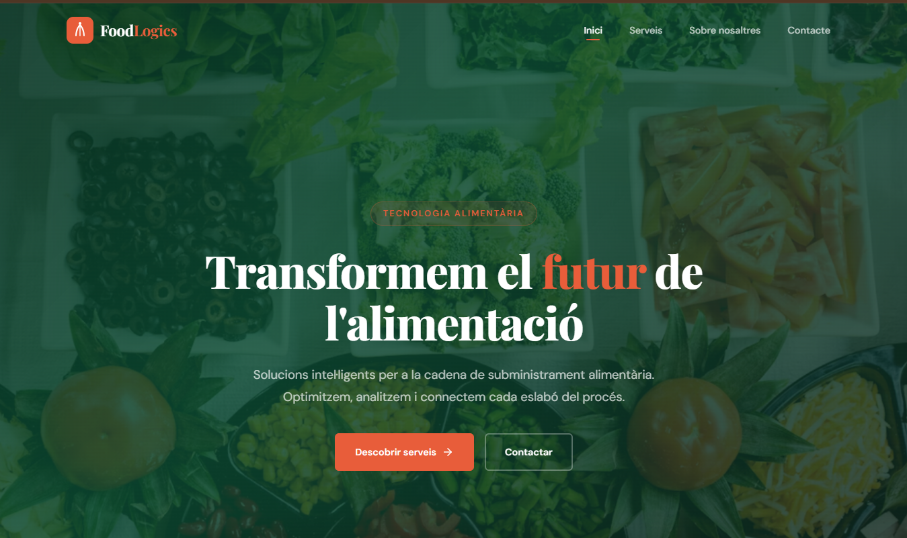
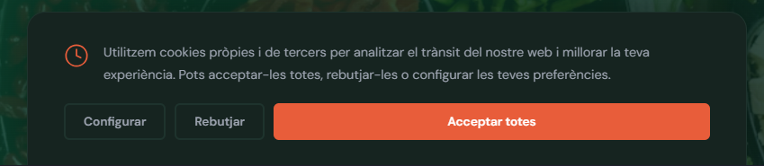
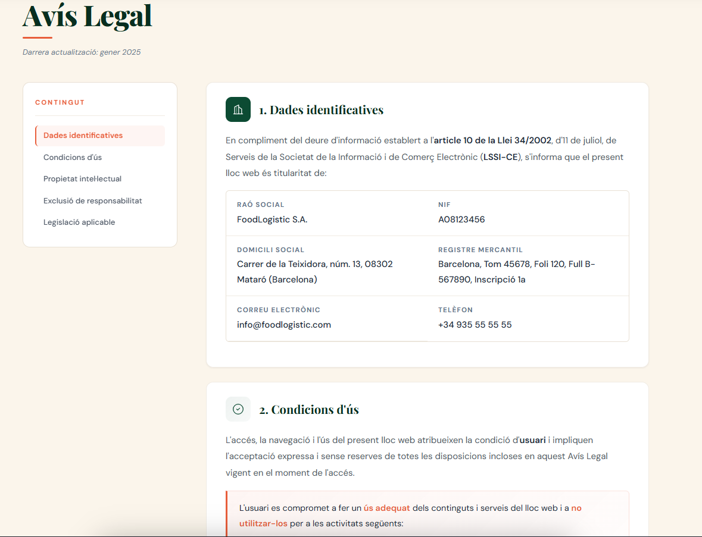
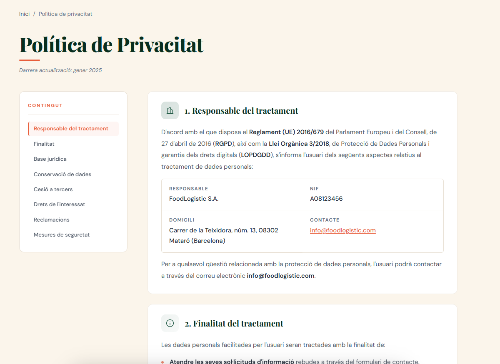
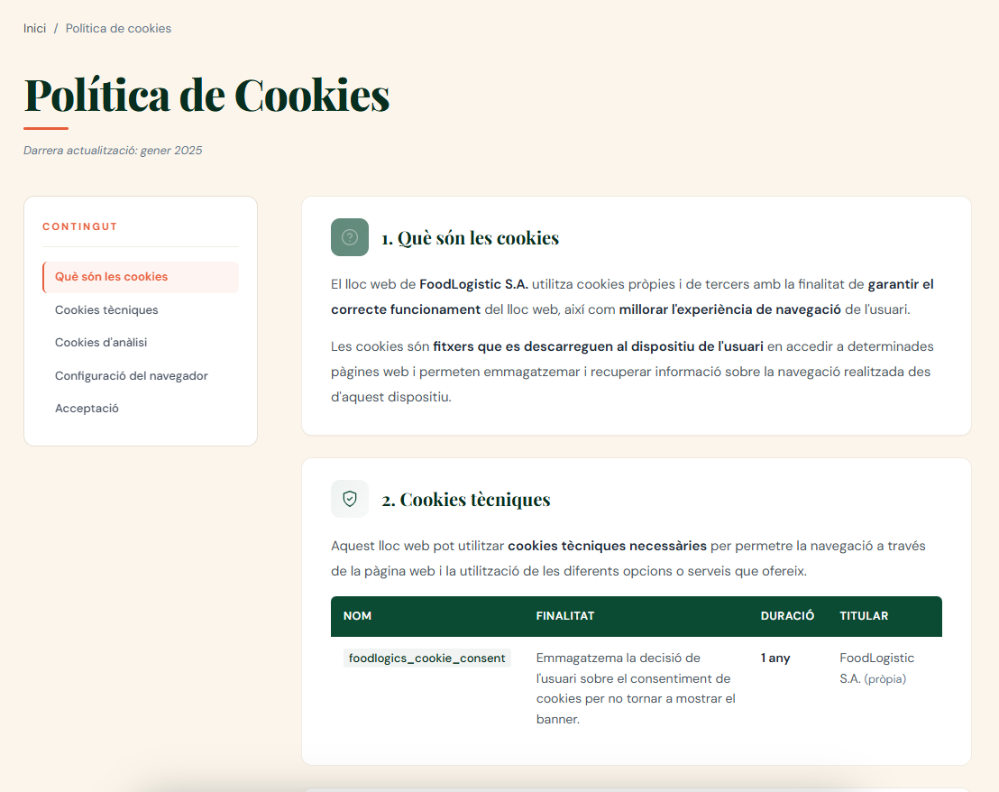

<br>
<br>
<br>
<br>
<br>
<br>
<br>
<br>

## 5. PRESSUPOST

### Introducció
Aquest pressupost explica quant pot costar el projecte per a **FoodLogístic S.A.** Inclou dues parts: el **cost inicial** per posar-ho en marxa i els **costos mensuals** per mantenir-ho funcionant.  
Els preus són aproximats i poden canviar segons el proveïdor o si l’empresa ja té algun equip o llicència.

---

### Dades de càlcul
- Càlcul fet per a **35 usuaris**.
- Mà d’obra: **45 € / hora**.
- Correu i treball en equip: **Microsoft 365 Empresa Estàndard** (**10,80 € / usuari / mes** amb pagament anual).

---

### Cost d’implantació
El cost inicial inclou instal·lar, configurar, provar i documentar el projecte. Hem estimat **81,5 hores** de feina, que són **3.667,50 €** de mà d’obra.

#### TAULA — Mà d’obra (implantació)

| Concepte | Dades | Import |
|---|---:|---:|
| Hores totals estimades | 81,5 h | — |
| Preu per hora | 45 € | — |
| **Total mà d’obra** | — | **3.667,50 €** |

---

### Equipament i llicències inicials
Hem calculat l’equip i les llicències mínimes per tenir un entorn professional i una base estable de servei.

#### TAULA — Equipament i llicències inicials

| Concepte | Subtotal |
|---|---:|
| Servidors, NAS i SAI | 3.070,33 € |
| Windows Server i CALs | 2.059,50 € |
| **Total equipament i llicències** | **5.129,83 €** |

---

### Total implantació
Sumant mà d’obra i equipament, el cost total d’implantació és de **9.797,33 €** (sense IVA).

#### TAULA — Total implantació

| Concepte | Import |
|---|---:|
| Mà d’obra | 3.667,50 € |
| Equipament i llicències | 5.129,83 € |
| **Total implantació** | **9.797,33 €** |

---

### Costos recurrents
Aquesta part és el que es paga per seguir funcionant cada mes: llicències, web i suport.

#### TAULA — Cost recurrent mensual

| Concepte | Cost mensual |
|---|---:|
| Microsoft 365 (35 usuaris) | 378,00 € |
| Hosting i domini web | 6,58 € |
| Suport i manteniment (6 h/mes) | 270,00 € |
| **Total mensual** | **654,58 €** |

---

### Cost recurrent anual
El cost recurrent anual és de **7.854,99 €** (sense IVA).

---

### Resum econòmic

#### TAULA — Resum final

| Tipus de cost | Import |
|---|---:|
| Cost únic d’implantació | 9.797,33 € |
| Cost mensual recurrent | 654,58 € |
| Cost anual recurrent | 7.854,99 € |

<br>
<br>
<br>
<br>
<br>
<br>
<br>
<br>

## 6 Planificació projecte

### Ordre tasques

Hem seguit un ordre simple perquè el projecte surti bé. Primer fem l’anàlisi, després la web, i en paral·lel anem fent la part tècnica. La part legal va després de tenir la web feta, i la web definitiva es decideix al final.

| Pas | Tasca | Què es fa              |
| --: | ----- | ---------------------- |
|   1 | T01   | Anàlisi inicial        |
|   2 | T02   | Creació web            |
|   3 | T03   | Servidor de fitxers    |
|   4 | T04   | Servidor d’impressores |
|   5 | T05   | Vídeos formatius       |
|   6 | T06   | Revisió legal web      |
|   7 | T07   | Serveis al núvol       |
|   8 | T08   | Web definitiva         |

### Paral·lel

Algunes feines es poden fer al mateix temps. Per exemple, els servidors i els vídeos es poden avançar mentre es treballa la web. Això ajuda a acabar abans sense baixar la qualitat.

### Dependències

Hi ha coses que bloquegen la resta: sense T01 no es pot començar bé; sense T02 no es pot fer T06; i sense T02 i T06 no es pot fer T08.

### Riscos

Els riscos principals són errors de disseny o tècnics a la web, errors en cookies i privacitat, i que la decisió final de la web trigui més del previst. Ho tenim en compte per no anar justos de temps.

### Camí crític

El camí crític és el que marca la durada total. Si es retarda una d’aquestes tasques, es retarda tot: **T01 → T02 → T06 → T08**.

### Temps estimat

Hem calculat hores per a cada tasca. El total és **78,5 hores**.

| Tasca     |    Hores |
| --------- | -------: |
| T01       |        8 |
| T02       |     10,5 |
| T03       |       13 |
| T04       |        9 |
| T05       |       13 |
| T06       |      9,5 |
| T07       |       10 |
| T08       |      5,5 |
| **Total** | **78,5** |

### Equip i rols

Som dos: **Pau** i **Vicenç**. Per organitzar-nos, repartim així:

*   **Pau:** coordinació general, servidors i núvol.
*   **Vicenç:** web, part legal i continguts.

Totes les parts importants es revisen entre els dos per evitar errors i retards.

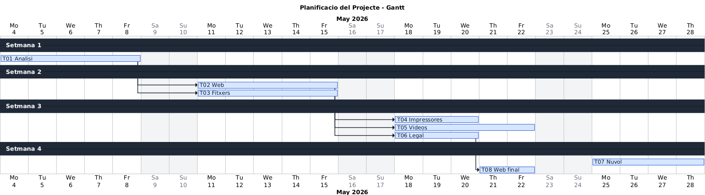

<br>
<br>
<br>
<br>
<br>
<br>
<br>
<br>

## 7. Conclusions

Amb aquesta proposta, FoodLogístic podrà treballar amb més tranquil·litat perquè millorem els punts més importants: que el servei no s’aturi, que les dades estiguin més protegides i que la feina sigui més fàcil.

Els **fitxers i les impressores** quedaran més ben organitzats i amb menys errors, així el magatzem i l’oficina no perdran temps quan hi hagi problemes.

El **correu al núvol** farà que el correu sigui més estable i que l’equip pugui treballar millor amb calendaris i eines de col·laboració.

La part de **seguretat i LOPD** ajuda a evitar descuits típics, perquè els treballadors tindran normes simples i formació clara sobre dades personals.

La **web nova** millora la imatge de l’empresa i compleix la normativa amb formulari i textos legals, cosa que dona confiança als clients.

Finalment, amb la **planificació i el pressupost**, el client pot veure clar el temps i el cost, i decidir amb tota la informació.