# Guia de la implementació de la infraestructura de fitxers  


## Punt 1 – Preparació i seguretat a l’Active Directory

Abans de crear les carpetes compartides, he preparat l’Active Directory per poder gestionar correctament els permisos.

### Creació de les Unitats Organitzatives (OU)

He creat una estructura d’Unitats Organitzatives separada per departaments, amb l’objectiu de mantenir l’entorn ordenat i facilitar l’administració:

```

foodlogistic.test
├── Administracio
├── Transport
└── Direccio

```

Aquesta estructura permet assignar permisos i polítiques segons el departament.

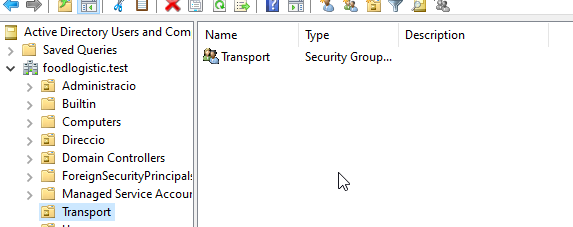

---

### Creació dels grups de seguretat

Dins de cada OU he creat grups de seguretat globals, que s’utilitzen per controlar l’accés a les carpetes compartides:

- **Administracio**: gestió de factures i albarans  
- **Transport**: xòfers i caps de flota  
- **Direccio**: gerència i informació confidencial  

Tots els grups s’han creat com a:
- Globals  
- De seguretat  

He creat usuaris de prova i els he afegit al seu grup corresponent per poder fer comprovacions posteriors.

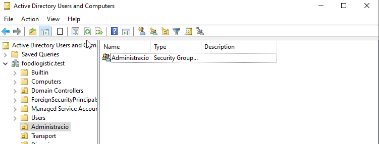
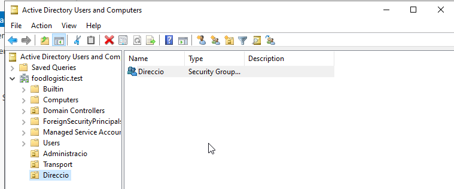


---

## Punt 2 – Implementació dels recursos compartits

En aquest punt he creat tres carpetes compartides.  

Totes les carpetes s’han creat al servidor de fitxers **FS01**, dins del directori:

```

D:\Dades\\

```

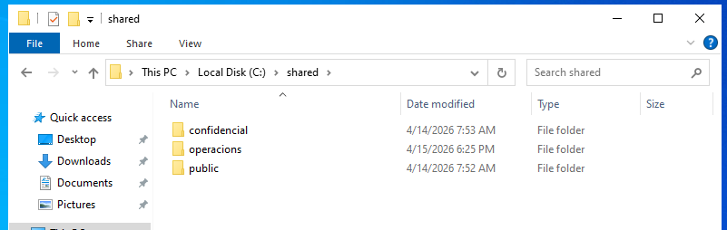

---

### Carpeta Public  
**Mètode utilitzat:** Explorador de fitxers

He creat la carpeta Public perquè sigui accessible per a tots els usuaris.

- He creat la carpeta `D:\Dades\Public`
- L’he compartit utilitzant l’Explorador de fitxers
- He configurat els permisos següents:
  - **Permisos SMB:** Everyone amb lectura
  - **Permisos NTFS:** Everyone amb modificació

Això permet que tots els usuaris puguin treballar amb els fitxers sense tenir control total.

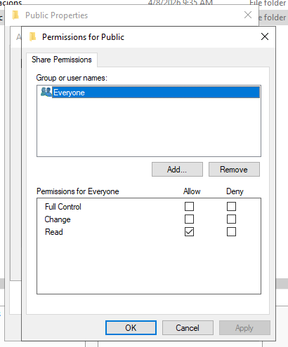
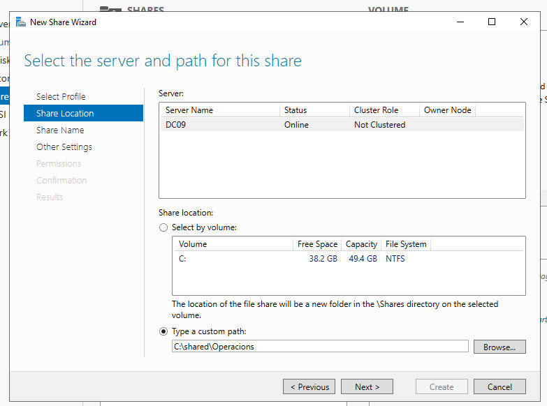
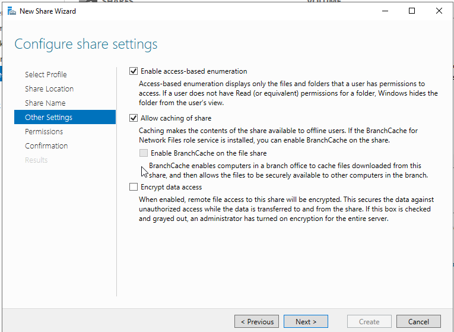
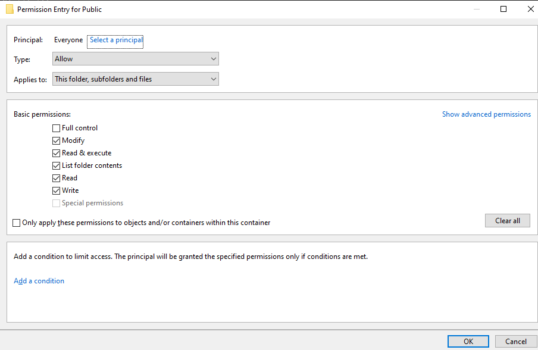

---

### Carpeta Operacions  
**Mètode utilitzat:** Server Manager

Aquesta carpeta està destinada exclusivament al departament de Transport.

- He creat la carpeta `D:\Dades\Operacions`
- He compartit la carpeta des del Server Manager
- He activat l’opció **Access-Based Enumeration** perquè només els usuaris autoritzats la puguin veure
- He configurat els permisos perquè només el grup **Transport** tingui accés
- He eliminat el grup **Everyone** dels permisos

Amb aquesta configuració, només els usuaris del grup Transport poden veure i accedir a la carpeta.

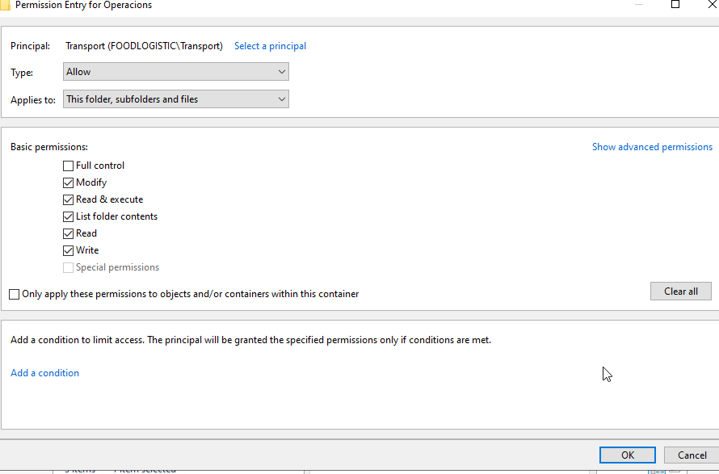

---

### Carpeta Direccio (confidencial)  
**Mètode utilitzat:** PowerShell

Aquesta carpeta conté informació confidencial del departament de direcció.

- He creat la carpeta `D:\Dades\Direccio`
- He configurat els permisos NTFS perquè només el grup **Direccio** pugui accedir-hi
- He compartit la carpeta mitjançant PowerShell, activant l’**Access-Based Enumeration**
- He creat una GPO perquè la carpeta es mapeji automàticament com a unitat **Z:** només als usuaris del grup Direccio

D’aquesta manera, la carpeta només és visible i accessible per les persones autoritzades.

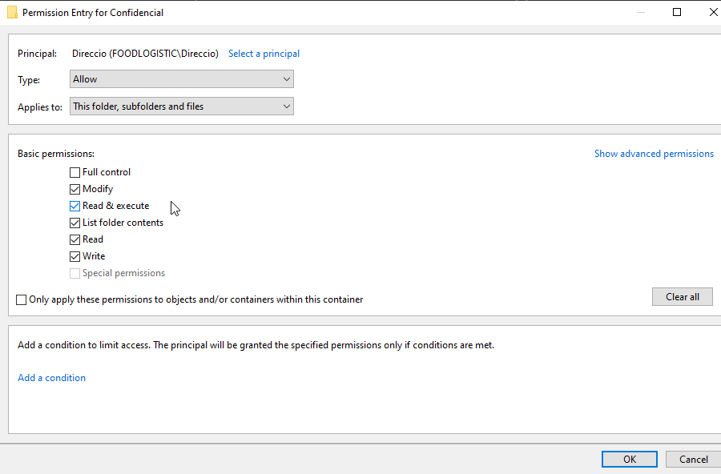

---

## Punt 3 – Control de l’emmagatzematge

Per controlar l’espai d’emmagatzematge i evitar l’ús inadequat del disc, he aplicat diferents tipus de quotes.

### Quotes NTFS (per usuari)

Al disc de dades he activat les quotes NTFS.

- He habilitat la gestió de quotes
- He establert un límit per defecte de **500 MB per usuari**
- He configurat el sistema perquè no permeti superar aquest límit

Això controla l’espai que pot ocupar cada usuari al servidor.

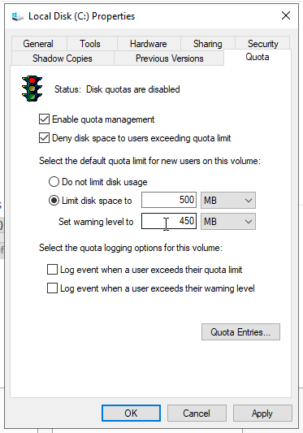

---

### FSRM (per carpeta)

He instal·lat el rol **File Server Resource Manager**.

#### Carpeta Public
- He aplicat una quota **hard** de **200 MB**
- He configurat un avís al **90%** de l’ús
- El missatge personalitzat indica que l’usuari està a punt d’esgotar l’espai compartit

#### Carpeta Operacions
- He creat un filtre de fitxers actiu
- He bloquejat fitxers executables (**.exe** i **.msi**)
- He bloquejat fitxers d’àudio i de vídeo

Això evita que es guardin programes o fitxers multimèdia innecessaris.

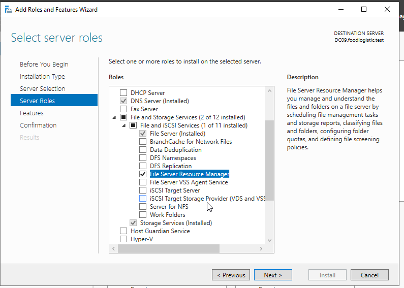
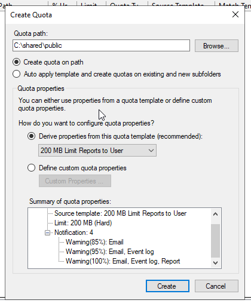

---

## Punt 4 – Verificació i proves

Finalment, he comprovat que tot funciona correctament des d’un client Windows unit al domini.

- He iniciat sessió amb usuaris de cada grup
- He verificat quines carpetes podia veure i utilitzar cada usuari
- He intentat copiar un fitxer executable a la carpeta Operacions i s’ha bloquejat
- He comprovat el funcionament de les quotes d’espai

Les proves confirmen que els permisos, les quotes i els filtres estan ben configurats.

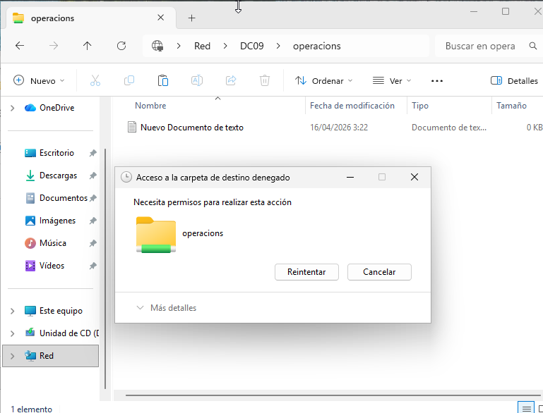
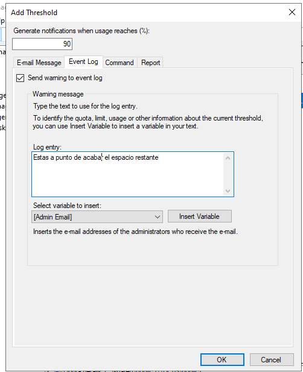
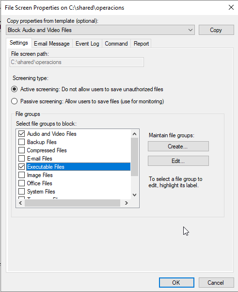