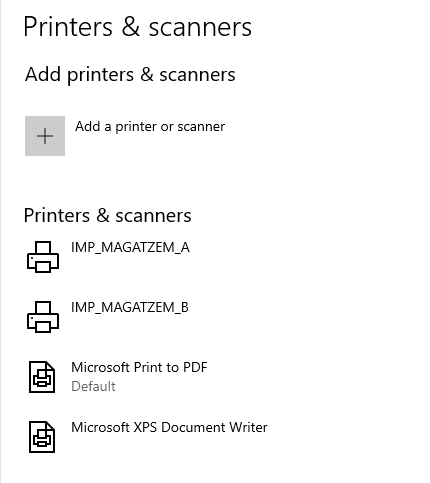
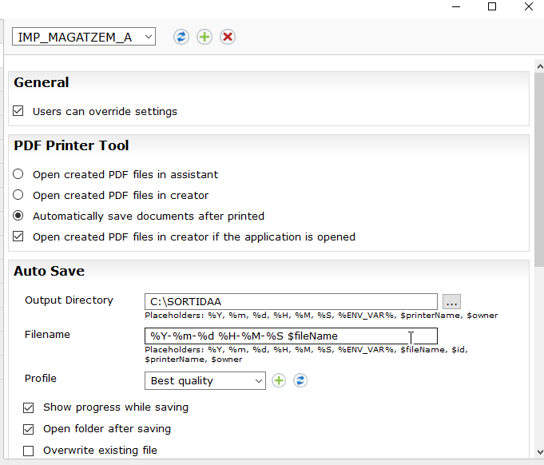
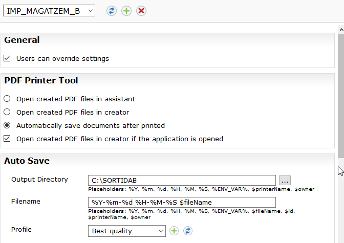
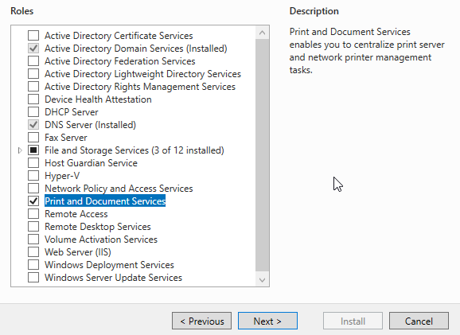
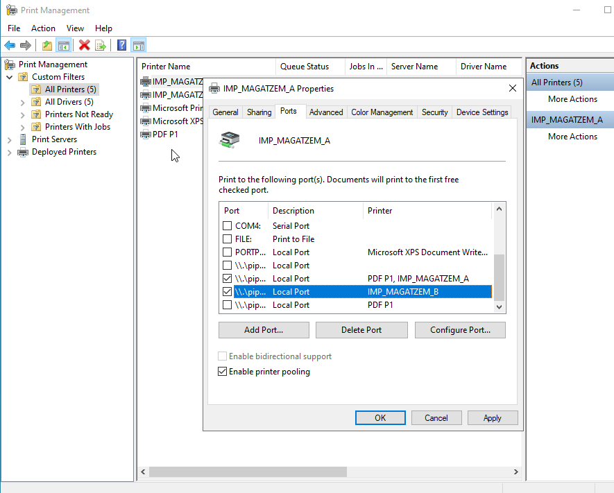
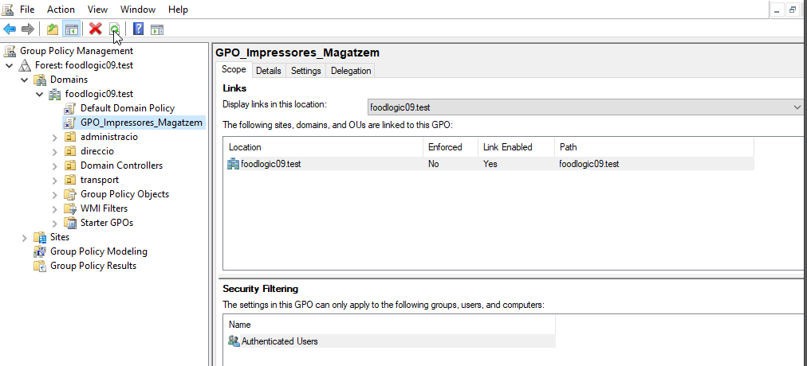
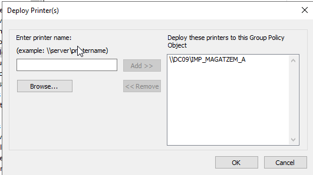
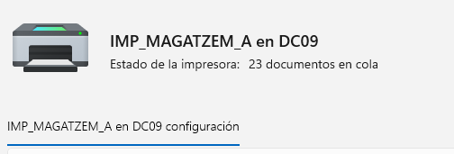

# Guia de Configuració del Servidor d’Impressió del Magatzem


### Instal·lació de les impressores PDF24

1. Instal·lar **PDF24 Printer** al servidor.
2. Crear **dues instàncies d’impressora**.
3. Renombrar-les amb noms corporatius:
   - `IMP_MAGATZEM_A`
   - `IMP_MAGATZEM_B`






---

## 2. Instal·lació del rol i configuració del Printer Pooling

### Instal·lació del rol de servidor d’impressió

1. Obrir **Server Manager**.
2. Afegir el rol **Print and Document Services**.
3. Finalitzar la instal·lació.

Aquest rol permet al servidor gestionar impressores i cues d’impressió.



---

### Configuració del Printer Pooling

1. Obrir la consola **Print Management**.
2. Anar a la impressora `IMP_MAGATZEM_A`.
3. Obrir **Printer Properties**.
4. A la pestanya **Ports**:
   - Marcar **Enable printer pooling**.
   - Seleccionar:
     - El port de `IMP_MAGATZEM_A`
     - El port de `IMP_MAGATZEM_B`



---

## 3. Desplegament automatitzat mitjançant GPO

L’empresa no vol que els treballadors instal·lin la impressora manualment.

### Creació de la GPO

1. Obrir **Group Policy Management**.
2. Crear una nova GPO amb el nom:
   - `GPO_Impressores_Magatzem`
3. Vincular-la al domini o a una **OU** amb l’usuari de proves.



---

### Desplegament de la impressora

1. Des de **Print Management**:
   - Clic dret sobre la impressora del magatzem.
   - Seleccionar **Deploy with Group Policy**.
2. Assignar-la a la GPO creada.



### Comprovació al client

1. Iniciar sessió a un **Windows 11** amb usuari del domini.
2. Executar:
   ```bash
   gpupdate /force
    ```

3.  Tancar i tornar a iniciar sessió.


***

## 4. Prova de càrrega i seguretat

### Simulació de balanceig de càrrega

1.  Enviar **10 documents seguits** a la impressora del magatzem.
2.  Observar com el servidor reparteix les feines entre les dues impressores.

Això confirma que el **Printer Pooling funciona correctament**.



***

### Restriccions d’horari

1.  Obrir **Printer Properties**.
2.  Anar a la pestanya **Advanced**.
3.  Configurar l’horari d’ús:
    *   De **06:00 a 22:00**

Fora d’aquest horari, la impressora no permetrà imprimir.

