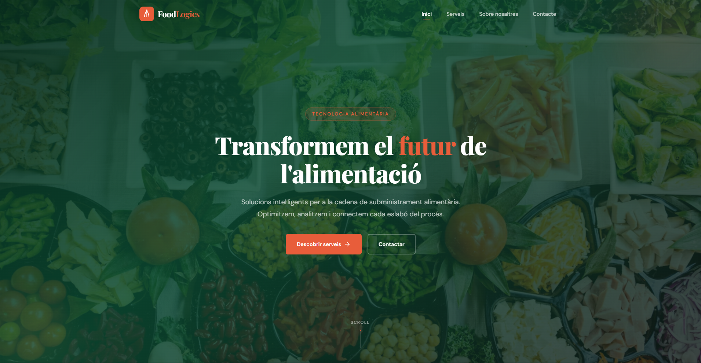
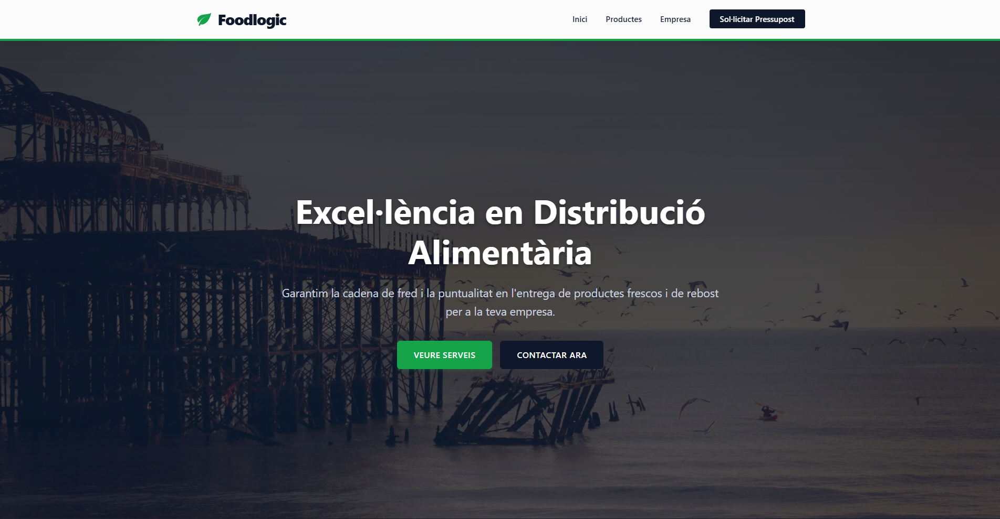

# PAS 1

## Web de PAU

### Punts forts

**Disseny visual**  
El disseny és modern i net, i fa bona impressió des del primer moment.

**Organització de la web**  
Les seccions estan ben separades i és fàcil saber on et trobes.

**Contingut**  
Explica bé què fa l’empresa i quins serveis ofereix.

**Aspecte professional**  
Sembla una web real d’una empresa, no només un exercici.

**Facilitat d’ús**  
Els botons i els textos es veuen clars i són fàcils d’entendre.

### Punts febles

**Contingut una mica genèric**  
Parla de tecnologia de manera correcta, però sense exemples concrets.

**Poca interacció**  
La pàgina no té gaire moviment ni animacions.

**Accessibilitat**  
No queda clar si està pensada per a persones amb dificultats visuals.

---

## Web de VICENÇ

### Punts forts

**Simplicitat**  
Probablement és una web senzilla i fàcil de navegar.

**Claredat**  
Pot ser clara si té pocs elements i no està carregada.

**Codi bàsic**  
És probable que el codi estigui ben estructurat i ordenat.

### Punts febles

**Disseny visual**  
Pot semblar més simple i menys atractiva visualment.

**Poc contingut**  
Normalment té menys text i menys explicació dels serveis.

**Imatge d’empresa**  
Dona més sensació d’exercici que de web corporativa real.

---

# PAS 2

## Web de PAU

Jo vaig dir que la web de PAU és més bonica visualment.  
Això fa que entri millor pels ulls i cridi més l’atenció.

També vaig comentar que el contingut està millor explicat.  
És fàcil entendre què fa l’empresa i quins serveis ofereix.

## Web de VICENÇ

Vaig dir que la web de VICENÇ és més senzilla.  
Això pot anar bé perquè no està gaire carregada.

També vaig comentar que pot ser fàcil de fer servir.  
La informació es pot trobar ràpidament.

---

# Proposta final: Web combinada

La proposta final combina idees de les dues webs.

De la web de **PAU** es manté el disseny modern, l’aspecte professional i el contingut ben explicat, perquè ajuda a entendre millor què fa l’empresa i dona bona imatge.

De la web de **VICENÇ** s’agafa la simplicitat i la claredat, ja que fan que la web sigui fàcil d’utilitzar i no estigui massa carregada.

El resultat és una web atractiva però senzilla, amb una estructura clara i una imatge més real d’empresa.  
També es millora la facilitat d’ús amb textos fàcils de llegir, una navegació simple i alguns detalls visuals que donen dinamisme sense complicar la pàgina.